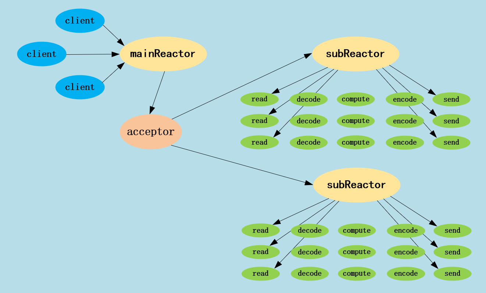
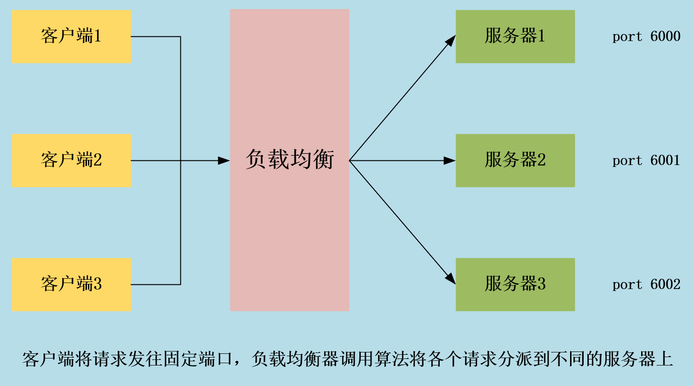
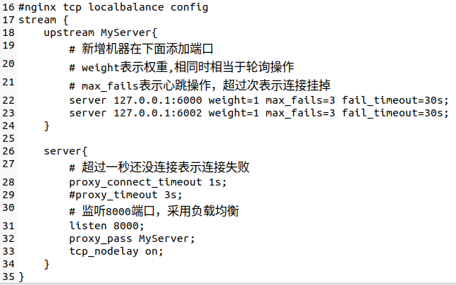
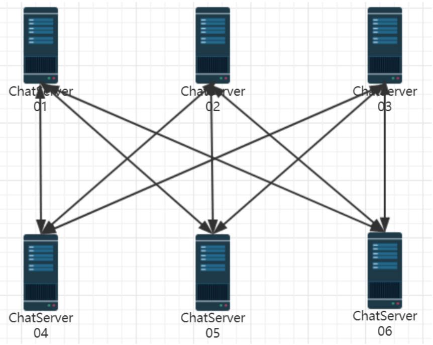
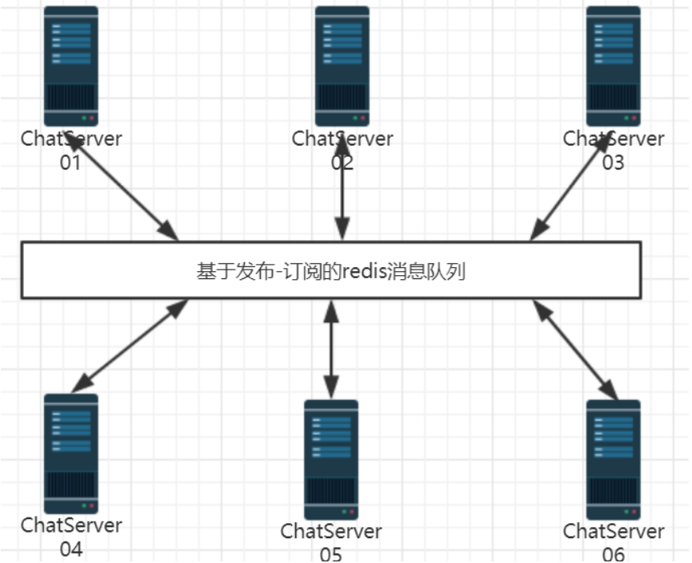

# ChatServer

在 Linux 环境下基于 muduo 开发的集群聊天服务器。实现新用户注册、用户登录、添加好友、添加群组、好友通信、群组聊天、保持离线消息等功能。

## 项目特点

- 基于 muduo 网络库开发网络核心模块，实现高效通信
- 使用第三方 JSON 库实现通信数据的序列化和反序列化
- 使用 Nginx 的 TCP 负载均衡功能，将客户端请求分派到多个服务器上，以提高并发处理能力
- 基于发布-订阅的服务器中间件redis消息队列，解决跨服务器通信难题
- 封装 MySQL 接口，将用户数据储存到磁盘中，实现数据持久化
- 基于 CMake 构建项目

## 必要环境

- 安装`boost`库
- 安装`muduo`库
- 安装`Nginx`
- 安装`redis`
- 安装`mysql`开发包

## 构建项目

创建数据库

```shell
# 连接MySQL
mysql -u root -p your passward
# 创建数据库
create database chat;
```

#执行脚本构建项目

```shell
bash autobuild.sh
```

## 执行生成文件

```shell
# 启动服务端
cd ./bin
./ChatServer 6000 
```

```shell
# 启动客户端
./ChatClient 127.0.0.1 8000
```


# 项目讲解

## 数据库表设计

**User表** 

| 字段名称 | 字段类型                  | 字段说明     | 约束                        |
| -------- | ------------------------- | ------------ | --------------------------- |
| id       | INT                       | 用户id       | PRIMARY KEY、AUTO_INCREMENT |
| name     | VARCHAR(50)               | 用户名       | NOT NULL, UNIQUE            |
| password | VARCHAR(50)               | 用户密码     | NOT NULL                    |
| state    | ENUM('online', 'offline') | 当前登录状态 | DEFAULT 'offline'           |

**Friend表**

| 字段名称 | 字段类型 | 字段说明 | 约束               |
| -------- | -------- | -------- | ------------------ |
| userid   | INT      | 用户id   | NOT NULL、联合主键 |
| friendid | INT      | 好友id   | NOT NULL、联合主键 |

**AllGroup表**

| 字段名称  | 字段类型     | 字段说明   | 约束                        |
| --------- | ------------ | ---------- | --------------------------- |
| id        | INT          | 组id       | PRIMARY KEY、AUTO_INCREMENT |
| groupname | VARCHAR(50)  | 组名称     | NOT NULL, UNIQUE            |
| groupdesc | VARCHAR(200) | 组功能描述 | DEFAULT ''                  |

**GroupUser表**

| 字段名称  | 字段类型                  | 字段说明 | 约束               |
| --------- | ------------------------- | -------- | ------------------ |
| groupid   | INT                       | 组id     | NOT NULL、联合主键 |
| userid    | INT                       | 组员id   | NOT NULL、联合主键 |
| grouprole | ENUM('creator', 'normal') | 组内角色 | DEFAULT 'normal'   |

**OfflineMessage表**

| 字段名称 | 字段类型    | 字段说明                   | 约束     |
| -------- | ----------- | -------------------------- | -------- |
| userid   | INT         | 用户id                     | NOT NULL |
| message  | VARCHAR(50) | 离线消息（存储Json字符串） | NOT NULL |

## 网络模块设计

我们会使用 muduo 完成网络模块的代码，在这之前我们需要了解 muduo 的基本使用。

muduo 的线程模型为「one loop per thread + threadPool」模型。一个线程对应一个事件循环（EventLoop），也对应着一个 Reactor 模型。EventLoop 负责 IO 和定时器事件的分派。

muduo 是主从 Reactor 模型，有 `mainReactor` 和 `subReactor`。`mainReactor`通过 `Acceptor` 接收新连接，然后将新连接派发到 `subReactor` 上进行连接的维护。这样 `mainReactor` 可以只专注于监听新连接的到来，而从维护旧连接的业务中得到解放。同时多个 `Reactor` 可以并行运行在多核 CPU 中，增加服务效率。因此我们可以通过 muduo 快速完成网络模块。



使用 muduo 注册消息事件到来的回调函数，并根据得到的 `MSGID` 定位到不同的处理函数中。以此实现业务模块和网络模块的解耦。

```cpp
// 上报读写事件相关信息的回调函数
void ChatServer::onMessage(const TcpConnectionPtr &conn,
                           Buffer *buffer,
                           Timestamp time)
{
    string buf = buffer->retrieveAllAsString();
    json js = json::parse(buf);
    
	// 业务模块和网络模块解耦
    auto msgHandler = ChatService::instance()->getHandler(js["msgid"].get<int>());
    // 回调消息绑定好的事件处理器，来执行相应的业务处理
    msgHandler(conn, js, time);
}
```

## 业务模块设计

### 注册模块

我们从网络模块接收数据，根据 `MSGID` 定位到注册模块。从传递过来的 `json` 对象中获取用户 ID 和用户密码。并以此生成 `User` 对象，调用 model 层方法将新生成的 `User` 插入到数据库中。

### 登录模块

从 `json` 对象中获取用户ID和密码，并在数据库中查询获取用户信息是否匹配。如果用户已经登录过，即 `state == "online"`，则返回错误信息。登录成功后需要在改服务端的用户表中记录登录用户，并显示该用户的好友列表和收到的离线消息。

### 客户端异常退出模块

如果客户端异常退出了，我们会从服务端记录用户连接的表中找到该用户，如果它断连了就从此表中删除，并设置其状态为 `offline`。

### 服务端异常退出模块

如果服务端异常退出，它会将所有在线的客户的状态都设置为 `offline`。即，让所有用户都下线。异常退出一般是 `CTRL + C` 时，我们需要捕捉信号。这里使用了 Linux 的信号处理函数，我们向信号注册回调函数，然后在函数内将所有用户置为下线状态。

### 点对点聊天模块

通过传递的 `json` 查找对话用户 ID：

- 用户处于登录状态：直接向该用户发送信息
- 用户处于离线状态：需存储离线消息

### 添加好友模块

从 `json` 对象中获取添加登录用户 ID 和其想添加的好友的 ID，调用 model 层代码在 friend 表中插入好友信息。

### 群组模块

创建群组需要描述群组名称，群组的描述，然后调用 model 层方法在数据库中记录新群组信息。
加入群组需要给出用户 ID 和想要加入群组的 ID，其中会显示该用户是群组的普通成员还是创建者。
群组聊天给出群组 ID 和聊天信息，群内成员在线会直接接收到。

## 使用Nginx负载均衡模块

### 负载均衡是什么

假设一台机器支持两万的并发量，现在我们需要保证八万的并发量。首先想到的是升级服务器的配置，比如提高 CPU 执行频率，加大内存等提高机器的物理性能来解决此问题。但是单台机器的性能毕竟是有限的，而且也有着摩尔定律也日已失效。

这个时候我们就可以增加服务器的数量，将用户请求分发到不同的服务器上分担压力，这就是负载均衡。那我们就需要有一个第三方组件充当负载均衡器，由它负责将不同的请求分发到不同的服务器上。而本项目，我们选择 `Nginx` 的负载均衡功能。



选择 `Nginx` 的 `tcp` 负载均衡模块的原因：

1. 把`client`的请求按照负载算法分发到具体的业务服务器`ChatServer`上
2. 能够`ChantServer`保持心跳机制，检测`ChatServer`故障
3. 能够发现新添加的`ChatServer`设备，方便扩展服务器数量

### 配置负载均衡



配置好后，重新加载配置文件启动。

```shell
/usr/local/nginx/sbin/nginx -s reload
```

## redis发布-订阅功能解决跨服务器通信问题

### 如何保证支持跨服务器通信

我们之前的`ChatServer`是维护了一个连接的用户表，每次向别的用户发消息都会从用户表中查看对端用户是否在线。然后再判断是直接发送，还是转为离线消息。

但是现在我们是集群服务器，有多个服务器维护用户。我们的`ChatServerA`要聊天的对象在`ChatServerB`，`ChatServerA`在自己服务器的用户表中找不到。那么可能对端用户在线，它却给对端用户发送了离线消息。因此，我们需要保证跨服务器间的通信！那我们如何实现，非常直观的想法，我们可以让后端的服务器之间互相连接。



上面的设计，让各个ChatServer服务器互相之间直接建立TCP连接进行通信，相当于在服务器网络之间进行广播。这样的设计使得各个服务器之间耦合度太高，不利于系统扩展，并且会占用系统大量的socket资源，各服务器之间的带宽压力很大，不能够节省资源给更多的客户端提供服务，因此绝对不是一个好的设计。

集群部署的服务器之间进行通信，最好的方式就是引入中间件消息队列，解耦各个服务器，使整个系统松耦合，提高服务器的响应能力，节省服务器的带宽资源，如下图所示：



